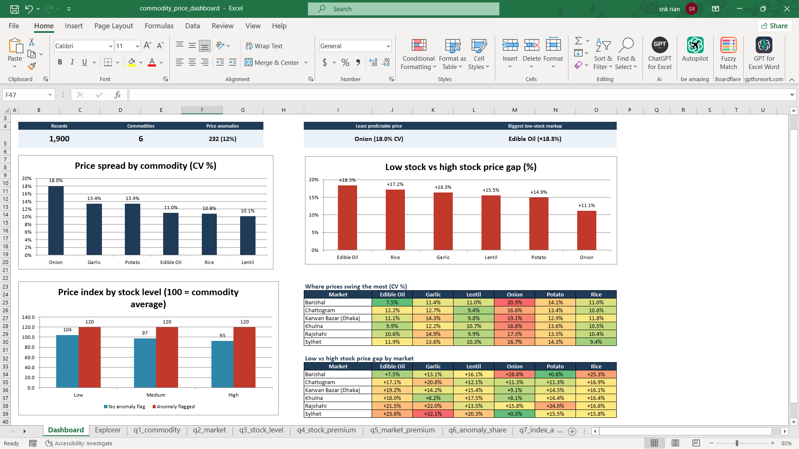

# Bangladesh Commodity Prices: Does Low Stock Push Prices Up?

Analysis of 1,900 purchase price records for 6 staple commodities across 6 markets in Bangladesh. I cleaned the data with Python, answered the business questions in SQL and generated an Excel dashboard for a supply chain manager who needs to know which items have unpredictable prices, where, and how much extra the business pays when stock runs low.

**Tools:** Python (pandas, XlsxWriter, pytest), SQL (DuckDB), Excel

## Business questions

1. What does each commodity cost on average, and how does that change by market?
2. How much does a low stock level add to the purchase price?
3. Which commodities and markets have the least predictable prices?

## Data

| | |
|---|---|
| Records | 1,900 |
| Commodities | Edible Oil, Garlic, Lentil, Onion, Potato, Rice |
| Markets | Barishal, Chattogram, Karwan Bazar (Dhaka), Khulna, Rajshahi, Sylhet |
| Seasons | Monsoon, Summer, Winter |
| Missing values in raw file | 0 |

Columns used: season, market, commodity, variety, unit, purchase price, stock level, weather, seasonal harvest flag, festival or event flag and day of week. The raw file also has one undocumented flag column. I dropped it during cleaning and derived a price anomaly flag instead, because a metric I can define and reproduce is more useful than a label I can't explain.

Source: [https://www.kaggle.com/datasets/suhridkhan/bangladesh-commodity-market-dataset]

## Repository layout

```
├── data/
│   ├── raw/bd_commodity_market.csv            original file, unchanged
│   └── processed/commodity_prices_clean.csv   created by step 1
├── src/
│   ├── 01_clean_data.py                       load, check, clean, flag anomalies
│   ├── 02_run_queries.py                      run the SQL and save results
│   └── 03_build_excel_dashboard.py            build the Excel dashboard
├── sql/
│   └── analysis.sql                           all analysis queries
├── tests/
│   └── test_clean_data.py                     unit tests for the cleaning rules
├── outputs/                                   one CSV per query + sql_results.md
├── dashboard/
│   └── commodity_price_dashboard.xlsx         created by step 3
├── docs/
│   └── excel_dashboard_guide.md               what is in the workbook
├── requirements.txt
└── LICENSE
```

## How to run

```bash
python -m venv .venv
source .venv/bin/activate        # Windows: .venv\Scripts\activate
pip install -r requirements.txt

python -m pytest                 # check the cleaning rules first
python src/01_clean_data.py
python src/02_run_queries.py
python src/03_build_excel_dashboard.py
```

## Cleaning steps

- Checked every column for missing values and exact duplicates. Duplicates are reported but kept, since without a date column two identical rows can be two real purchases.
- Renamed columns to snake_case and renamed `Session` to `season`, which is what it holds.
- Stripped extra spaces and standardised the case of label columns. Variety names keep their original case so "BR-28 Rice" stays intact.
- Added `stock_order` (Low = 1, Medium = 2, High = 3) so stock levels sort correctly in SQL and Excel, and a `city` column for mapping.
- Derived `price_anomaly`: 1 when a purchase is more than 15% above the median price for the same variety and season, with `peer_median_price` and `pct_vs_peer` kept alongside so every flag can be checked.
- Validated stock levels, Yes/No flags and one unit per commodity. The script stops if any check fails.
- The cleaning rules are covered by unit tests in `tests/test_clean_data.py`.

## SQL analysis

All queries are in [sql/analysis.sql](sql/analysis.sql) and every result is in [outputs/sql_results.md](outputs/sql_results.md).

- q1 and q2: average price and spread by commodity and by market
- q3, q4 and q5: price by stock level, the low vs high stock gap, and the same gap per market
- q6 and q7: whether low stock produces more price anomalies, and whether the low-stock premium holds once anomalies are left out. q7 uses a window function to index each price to its commodity average so items priced per kg and per litre sit on one scale
- q8: weather and harvest season

Average purchase price by stock level:

| commodity | avg_low | avg_medium | avg_high | low_minus_high | low_vs_high_pct |
|:---|---:|---:|---:|---:|---:|
| Edible Oil | 187.30 | 169.01 | 158.28 | 29.02 | 18.3 |
| Rice | 73.95 | 67.38 | 63.09 | 10.86 | 17.2 |
| Garlic | 172.60 | 156.56 | 148.40 | 24.20 | 16.3 |
| Lentil | 132.16 | 120.93 | 114.37 | 17.78 | 15.5 |
| Potato | 34.24 | 31.14 | 29.80 | 4.44 | 14.9 |
| Onion | 91.89 | 84.38 | 82.73 | 9.16 | 11.1 |

## Excel dashboard

`src/03_build_excel_dashboard.py` turns the SQL outputs into `dashboard/commodity_price_dashboard.xlsx`:

- **Dashboard:** KPI tiles, charts for price spread, the low-stock gap and the anomaly check, plus two market heatmaps
- **Explorer:** pick a commodity from a dropdown to see prices by market and stock level, calculated live with AVERAGEIFS, COUNTIFS and SUMPRODUCT
- One sheet per SQL query, the clean data as an Excel table and a notes sheet with definitions




## What the data says

1. Onion has the least predictable price, with a coefficient of variation of 18.0%. Lentil is the most stable at 10.1%.
2. Low stock came with a higher average price than high stock for 6 of 6 commodities. The gap ranged from +11.1% (Onion) to +18.3% (Edible Oil).
3. With every price indexed to its commodity average (100 = average), low-stock purchases came in at 108.7 and high-stock purchases at 94.2.
4. 234 purchases (12.3%) were flagged as price anomalies, meaning more than 15% above the median price for the same variety and season. They cluster in low-stock periods: 29.4% of low-stock purchases are anomalies against 6.3% of high-stock purchases. With anomalies left out, low stock averages an index of 104.1 against 92.5 for high stock, so the premium is broad-based rather than driven by a few extreme purchases.
5. By weather and harvest, prices ran highest in flood conditions outside harvest season (index 113.6, 65 rows) and lowest in sunny conditions during harvest season (index 90.7, 451 rows).

## What I'd tell the supply chain manager

- Hold more buffer stock of onion and garlic. Their prices are the hardest to predict.
- Reorder edible oil and rice before stock runs low. They show the biggest low-stock markup.
- Set a price alert at 15% above the usual price for each variety. Most alerts would fire during low-stock periods, which is when a second supplier quote is worth the effort.
- Use the CV heatmap on the dashboard to decide where fixed-price contracts would help most.

## Limitations

- There are no dates, so "volatility" means how spread out prices are across purchases (standard deviation and CV %), not how they moved over time.
- Units differ (Onion: Kg, Garlic: Kg, Potato: Kg, Edible Oil: L, Rice: Kg, Lentil: Kg), so commodities are compared with CV % or the price index rather than raw averages.
- The 15% anomaly cut-off is a business rule, not a statistical law. Change ANOMALY_THRESHOLD in src/01_clean_data.py to try other values.
- Stock level, weather and season can overlap, so these results show association, not cause.
- Some market and stock level combinations have only a few rows. Check n_low and n_high in q5 before reading too much into a single market.


